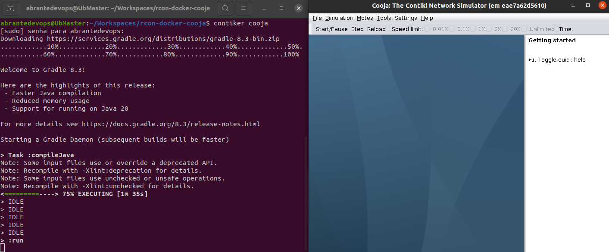
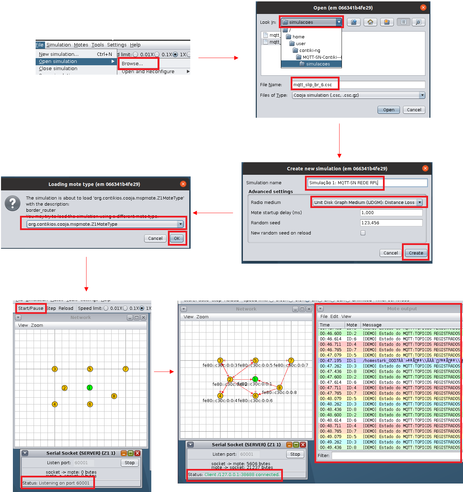
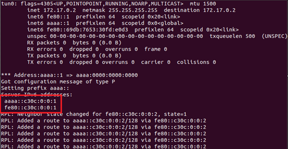
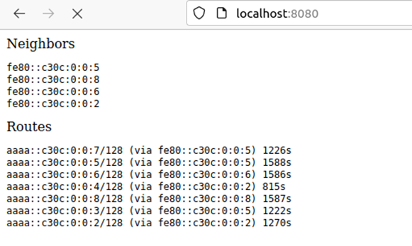

<h1 align="center">Utilização do Docker para o provisionamento do simulador Cooja no Contiki-NG</h1>

<p align="center">
  <a href="#-sobre-o-projeto">Sobre o projeto</a> •
  <a href="#-como-executar-o-projeto">Requisitos</a> •
  <a href="#-prov">Cooja Simulator</a> •
  <a href="#-tecnologias">Cenários Estudados</a> •
  <!-- <a href="#-ref">Referências</a> •
  <a href="#-autor">Autor</a> -->
</p>
<hr>
<h2 id="-sobre-o-projeto">Sobre o projeto</h2>

<p align="justify">Este projeto tem como objetivo a utilização do Docker para o provisionamento do simulador Cooja no Contiki-NG. O Contiki-NG é um sistema operacional de código aberto para a Internet das Coisas. O Contiki-NG é uma continuação do Contiki OS, um sistema operacional de código aberto para redes de sensores sem fio, sendo desenvolvido por uma equipe mundial de desenvolvedores independentes, com o apoio de empresas como a Atmel, Cisco, Texas Instruments, Zolertia, etc.</p>

<h2 id="-como-executar-o-projeto">Requisitos</h2>

<p align="justify">

- Toda a implementação foi realizada na distribuição Ubuntu 20.04. LTS Focal Fossa;
- Ter o Docker instalado, para isso execute o script install_docker.sh</p>

```bash
$ git clone https://github.com/abrantedevops/rcon-docker-cooja
$ cd rcon-docker-cooja
$ chmod +x install_docker.sh && ./install_docker.sh
```

<h2 id="-prov">Cooja Simulator</h2>

<p align="justify">Para a utilização do Cooja Simulator através do Docker realize os seguintes passos:</p>

```bash
$ git clone https://github.com/abrantedevops/rcon-docker-cooja
$ chmod 777 -R rcon-docker-cooja
$ cd rcon-docker-cooja
$ git submodule update --init --recursive
$ Dê o comando pwd no terminal e anote a saída, por exemplo: /home/thiago/rcon-docker-cooja
$ export CNG_PATH=/home/thiago/rcon-docker-cooja
$ xhost +
$ alias contiker="sudo docker run --privileged --sysctl net.ipv6.conf.all.disable_ipv6=0 --mount type=bind,source=$CNG_PATH,destination=/home/user/contiki-ng -e DISPLAY=$DISPLAY -e LOCAL_UID=$(id -u $USER) -e LOCAL_GID=$(id -g $USER) -v /tmp/.X11-unix:/tmp/.X11-unix -v /dev/bus/usb:/dev/bus/usb -ti --name coojasim contiker/contiki-ng"
$ contiker cooja
```

<p align="justify">Após a compilação, o container será iniciado e a tela inicial do Cooja será aberta conforme a imagem abaixo:</p>

<p align="center">
  
</p>

<hr>

<h2 id="-tecnologias">Cenários Estudados</h2>

<h3>Simulação 1: Funcionamento de uma Rede RPL com o protocolo MQTT-SN.</h3>

<p align="justify">Nesta simulação foi utilizado o protocolo MQTT-SN para a comunicação de uma rede RPL entre oito nós. O cenário é caracterizado por conter oito nós, sendo um deles o roteador de borda RPL e os outros sete nós responsáveis pelo envio de dados. Ao receber os dados, o roteador de borda RPL envia-os para o broker MQTT-SN, que por sua vez encaminha para o cliente MQTT-SN que esta inscrito no tópico de interesse</p>

<p align="justify">Para esta simulação, realize os seguintes passos:</p>

<p align="justify"> 

I) Com o simulador aberto na tela inicial, abra o cenário em:<br>
File > Open Simulation > Browser; <br> Na janela que abrir selecione a simulação "mqtt_slip_br6.csc" no caminho:<br> /home/user/contiki-ng/MQTT-SN-Contiki---HomeStark/simulacoes</p>

II) Inicie a simulação em "Start/Pause" localizado no canto superior esquerdo da tela. Nesse momento note que no quadro "Mote Output" o roteador de bordar (nó 1) aguarda receber um prefixo IP para a conexão externa, enquanto os outros nós estão no estado MQTT CONNACK.

III) Para efetivar a comunicação, abra três terminais e execute os seguintes comandos:

```bash
No terminal 1 (Habilitar o Tunelamento):

$ sudo docker exec -it coojasim bash
$ cd ~/contiki-ng/tools/serial-io ; make
$ cd ~/contiki-ng/MQTT-SN-Contiki---HomeStark/scripts_aux ; echo -e '#!'"/bin/bash\nsudo $HOME/contiki-ng/tools/serial-io/tunslip6 -a 127.0.0.1 aaaa::1/64\n" > webserver_slip.sh ; chmod +x webserver_slip.sh ; ./webserver_slip.sh

No Terminal 2 (Iniciar o Broker MQTT-SN): 

$ sudo docker exec -it coojasim bash
$ cd ~/contiki-ng/MQTT-SN-Contiki---HomeStark/tools ; unzip mosquitto.rsmb.zip 
$ cd mosquitto.rsmb/rsmb/src ; ./broker_mqtts config.mqtt

No Terminal 3 (Iniciar o Cliente MQTT-SN):

$ sudo docker exec -it coojasim bash
$ cd ~/contiki-ng/MQTT-SN-Contiki---HomeStark/tools/mosquitto.rsmb/rsmb/src ; mosquitto_sub -t "#" -v -i t1
```
<br>
Obs.: Os comandos anteriores são necessários na primeira execução do simulador. Nas seguintes, basta executar os passos abaixo:
<br><br>

```bash
No terminal 1 (Habilitar o Tunelamento):
$ sudo docker exec -it coojasim bash
$ cd ~/contiki-ng/MQTT-SN-Contiki---HomeStark/scripts_aux ; ./webserver_slip.sh

No Terminal 2 (Iniciar o Broker MQTT-SN):
$ sudo docker exec -it coojasim bash
$ cd ~/contiki-ng/MQTT-SN-Contiki---HomeStark/tools/mosquitto.rsmb/rsmb/src ; ./broker_mqtts config.mqtt

No Terminal 3 (Iniciar o Cliente MQTT-SN):
$ sudo docker exec -it coojasim bash
$ cd ~/contiki-ng/MQTT-SN-Contiki---HomeStark/tools/mosquitto.rsmb/rsmb/src ; mosquitto_sub -t "#" -v -i t1
```

<br>
<p align="justify"> Nesse momento, observe que no quadro "Network" o roteador de bordar recebeu um prefixo IP para a conexão externa e os nós começaram a enviar os dados, ao mesmo tempo no Broker MQTT-SN é possível verificar a conexão dos nós e o envio dos dados para o cliente MQTT-SN.</p>

<p align="justify">A imagem abaixo ilustra o passo a passo bem como o funcionamento da rede RPL com o protocolo MQTT-SN.</p>
<p align="center">
  
</p>

<p align="justify">Para acessar informações sobre a tabela de roteamento e os dispositivos vizinhos do roteador de borda RPL, é necessário ter o ipv6 do tunelamento obtido anteriomente, tal como na imagem abaixo:</p>

<p align="center">
  
</p>

<p align="justify">Com o ipv6 do tunelamento e a simulação em execução:</p>

```bash
Entre no container do Cooja:
$ sudo docker exec -it coojasim bash 
$ apt install curl -y
$ curl -v http://[aaaa::c30c:0:0:1]
```

<p align="justify">Nesse momento será exibido as informações sobre a tabela de roteamento e os dispositivos vizinhos do roteador de borda RPL a partir do terminal do container do Cooja. Porém, para poder visualizar essas informações no terminal do host, ou seja, fora do container do Cooja, é necessário realizar o seguinte procedimento:</p>

```bash
$ sudo docker exec -it coojasim bash
$ apt install openssh-server -y
$ service ssh start
$ passwd user (Defina uma senha para o usuário user)
# Veja o ip do container Cooja através do comando: hostname -I (Aqui o ip foi: 172.17.0.2)
# Saia do container e no terminal do host execute:
ssh -L 8080:[aaaa::c30c:0:0:1]:80 -N -f -l user 172.17.0.2
# Informe a senha definida anteriormente
```

<p align="justify">Dessa forma, quando acessamos o endereço http://localhost:8080 no navegador do host, é possível visualizar a tabela de roteamento e os dispositivos vizinhos do roteador de borda RPL. A imagem abaixo ilustra o resultado:</p>

<p align="center">
  
</p>
<p align="center">A simulação deve estar em andamento para que as informações sejam exibidas.</p>

<hr>

<!-- <h3>Simulação 2: Rede IoT com Banco de dados MYSQL e Grafana</h3> -->
